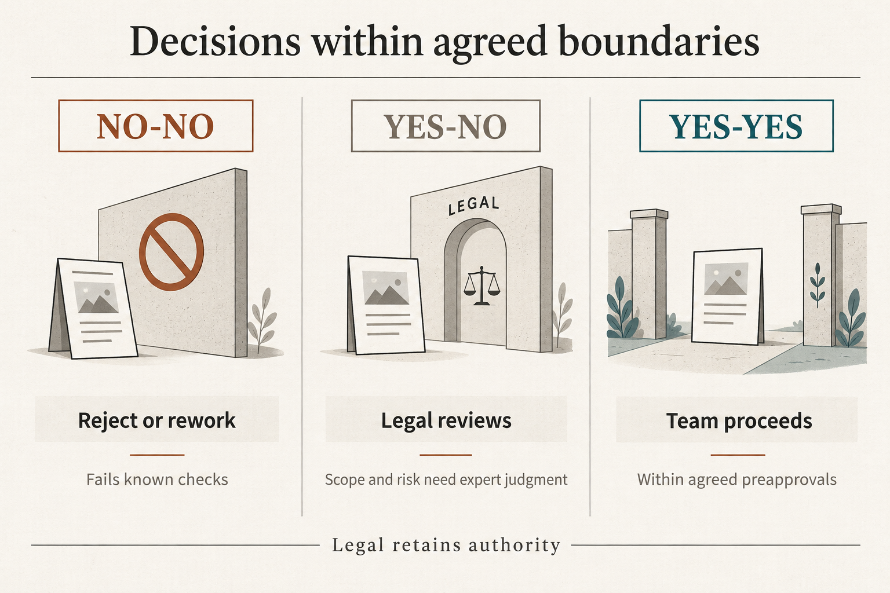

A marketing team I worked with brought some campaigns below **24 hours** by building shared decision boundaries and preapprovals with Legal.

**Why it matters:** Repeated approval requests consume time on both sides. Shared criteria let the team handle familiar cases and reserve expert judgment for proposals that need it.

**Where work got stuck:** We were experimenting with communications about a regulated product. Legal and Compliance had to approve campaigns, and the company structure kept that authority outside the team.

A weekly session gave us reliable access to a lawyer. A campaign could still wait **up to seven days** for review. If the lawyer rejected part of an idea, people had to rethink the campaign while trying to secure approval in the same conversation.

**Three decisions we learned to distinguish:** We built tools with Legal as we worked, making its criteria usable earlier.

- **No-no: reject or rework.** A checklist helped the team discard or revise proposals that failed known checks before taking them to the lawyer. That reduced back-and-forth.
- **Yes-no: seek expert review.** The team could reshape an experiment's scope and bring it back for assessment. Legal still judged the risk and made the approval decision.
- **Yes-yes: use an agreed preapproval.** Familiar campaign patterns could proceed within conditions already agreed with Legal. New or more complex experiments still needed expert review.

**How the boundaries evolved:** For illustration, imagine Legal rejecting a proposal to communicate a product feature to a broad audience. The team proposes a limited experiment with one specific segment, and the lawyer considers that revised experiment's risk acceptable.

Changing the scope changes the proposal being assessed. It can move from “no-no” to “yes-no”, with Legal still deciding. My contribution was to help the marketing manager explore those conditions.

We kept turning what we learned into shared criteria and preapprovals. **Legal retained its authority; the team gained more decisions it could handle within agreed boundaries.** The lawyer could focus on cases that still needed expert judgment.

This was part of the [protected-autonomy pilot](/work/protected-autonomy/). The **under-24-hour** result concerned some campaigns within that protected scope.

For your next recurring approval, ask the expert what the team could recognise earlier, which conditions would allow a preapproval, and when it should return for review. Does each review leave the team better equipped for the next decision?
